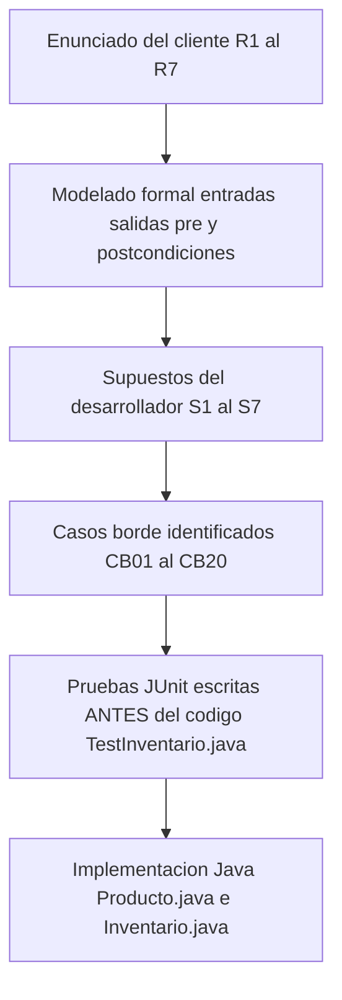

# 📄 Documento de Trazabilidad
## Sistema de Gestión de Inventario — *Test-First Thinking*
### Unidad 1: Modelado de Problemas y Especificación Formal

---

## 1. Modelado del Problema

### Tabla de Operaciones

| **Operación**         | **Entradas**                                                        | **Salida**                  | **Precondición**                                                                 | **Postcondición**                                                                                       |
|-----------------------|---------------------------------------------------------------------|-----------------------------|----------------------------------------------------------------------------------|---------------------------------------------------------------------------------------------------------|
| `agregarProducto`     | `nombre: String`, `precio: double`, `cantidad: int`, `categoria: String` | `void` (modifica estado)    | `nombre` no existe en inventario; `precio > 0`; `cantidad >= 0`; `nombre != null`; `categoria != null` | Producto almacenado en inventario con exactamente los datos recibidos                                   |
| `vender`              | `nombre: String`, `cantidad: int`                                   | `void` (modifica estado)    | Producto con ese nombre existe; `0 < cantidad <= stock actual`                 | `stock = stock_anterior - cantidad`                                                                    |
| `restock`             | `nombre: String`, `cantidad: int`                                   | `void` (modifica estado)    | Producto existe; `cantidad > 0`                                    | `stock = stock_anterior + cantidad`                                                                    |
| `consultarStock`      | `nombre: String`                                                    | `int`                       | Producto existe; `nombre != null`                                  | Retorna entero `>= 0` igual al stock actual; no modifica el inventario                                 |
| `productosStockBajo`  | *(ninguna)*                                                         | `List<Producto>`            | *(ninguna)*                                                        | Retorna lista con todos los productos donde `stock < umbralMinimo`; lista vacía si ninguno califica     |
| `valorTotal`          | *(ninguna)*                                                         | `double`                    | *(ninguna)*                                                        | Retorna `suma(precio_i × cantidad_i)` para todos los productos; retorna `0.0` si inventario vacío      |
| `aplicarDescuento`    | `categoria: String`, `porcentaje: double`                           | `void` (modifica estado)    | `0.0 <= porcentaje <= 50.0`; `categoria != null`                   | Para cada producto de esa categoría: `precio_nuevo = precio_anterior × (1 - porcentaje/100)`; productos de otras categorías no se modifican |

---

## 2. Supuestos del Desarrollador

| **ID** | **Supuesto**                                                                                                                                         | **Impacto**                                                      |
|--------|------------------------------------------------------------------------------------------------------------------------------------------------------|------------------------------------------------------------------|
| S1 | Los nombres de productos son **case-insensitive**. `"Mouse"` y `"mouse"` son el **mismo producto**. Internamente se almacenan en minúsculas. | Afecta `agregarProducto`, `vender`, `restock`, `consultarStock` |
| S2     | Las categorías son **Strings libres**, no existe un enum predefinido. `"Electronica"` ≠ `"electronica"` al filtrar descuentos.                    | Afecta `aplicarDescuento`                                        |
| S3 | Los nombres de productos no pueden contener caracteres especiales ni espacios. Solo se permiten letras y números. | Afecta `agregarProducto`, `vender`, `restock`, `consultarStock` |
| S4     | Invocar `vender`, `restock` o `consultarStock` con un nombre que **no existe** lanza `IllegalArgumentException`.                                    | Afecta `vender`, `restock`, `consultarStock`                     |
| S5     | Aplicar `aplicarDescuento` a una categoría **sin productos** no lanza excepción; simplemente no modifica nada.                                      | Afecta `aplicarDescuento`                                        |
| S6     | `restock` con `cantidad = 0` se considera **inválido** y lanza `IllegalArgumentException`.                                                           | Afecta `restock`                                                 |
| S7     | Los precios se manejan como `double`. Las comparaciones en pruebas usan **delta de `0.001`**.                                                        | Afecta `valorTotal`, `aplicarDescuento`                          |

---

## 3. Casos Borde Identificados

| **ID** | **Categoría**   | **Operación**         | **Caso Borde**                        | **Comportamiento Esperado**                                         |
|--------|-----------------|----------------------|----------------------------------------|---------------------------------------------------------------------|
| CB01   | Valor límite    | `vender`             | Vender exactamente todo el stock       | `stock = 0`, no lanza excepción                                    |
| CB02   | Valor límite    | `vender`             | Vender exactamente 1 unidad            | `stock = stock_anterior - 1`                                       |
| CB03   | Valor límite    | `agregarProducto`    | `cantidad = 0` en creación             | Se permite, stock inicial = 0                                      |
| CB04   | Valor límite    | `aplicarDescuento`   | Descuento exactamente del `50%`        | `precio_nuevo = precio_anterior * 0.5`                             |
| CB05   | Valor límite    | `aplicarDescuento`   | Descuento exactamente del `0%`         | Precio no cambia                                                   |
| CB06   | Vacío/Nulo      | `valorTotal`         | Inventario sin productos               | Retorna exactamente `0.0`                                          |
| CB07   | Vacío/Nulo      | `productosStockBajo` | Inventario completamente vacío          | Retorna lista vacía, no excepción                                  |
| CB08   | Vacío/Nulo      | `agregarProducto`    | `nombre = null`                        | Lanza `IllegalArgumentException`                                   |
| CB09   | Vacío/Nulo      | `agregarProducto`    | `nombre = ""` (String vacío)          | Lanza `IllegalArgumentException`                                   |
| CB10   | Overflow        | `restock`            | `cantidad = Integer.MAX_VALUE`          | Lanza `IllegalArgumentException`                                   |
| CB11   | Overflow        | `agregarProducto`    | `cantidad = Integer.MAX_VALUE`          | Lanza `IllegalArgumentException`                                   |
| CB12   | Duplicados      | `agregarProducto`    | Nombre ya existente, misma categoría    | Lanza `IllegalArgumentException`                                   |
| CB13   | Duplicados      | `agregarProducto`    | Nombre ya existente, diferente categoría| Sigue siendo duplicado, lanza `IllegalArgumentException`           |
| CB14   | Formato         | `agregarProducto`    | `precio = 0.0`                         | Lanza `IllegalArgumentException`                                   |
| CB15   | Formato         | `agregarProducto`    | `precio` negativo (ej. `-10.0`)         | Lanza `IllegalArgumentException`                                   |
| CB16   | Formato         | `vender`             | `cantidad = 0`                         | Lanza `IllegalArgumentException`                                   |
| CB17   | Formato         | `vender`             | `cantidad` negativa (ej. `-3`)          | Lanza `IllegalArgumentException`                                   |
| CB18   | Formato         | `aplicarDescuento`   | `porcentaje > 50` (ej. `75.0`)          | Lanza `IllegalArgumentException`                                   |
| CB19   | Formato         | `aplicarDescuento`   | `porcentaje` negativo (ej. `-10.0`)     | Lanza `IllegalArgumentException`                                   |
| CB20   | Valor límite    | `productosStockBajo` | Stock exactamente igual al umbral       | NO aparece en lista (condición es `stock < umbral`)                |

---

## 4. Matriz de Trazabilidad req → test → código

| #   | Requisito         | Casos Borde                        | Pruebas JUnit                                                                                                   | Método Implementado      | Estado        |
|-----|-------------------|------------------------------------|------------------------------------------------------------------------------------------------------------------|--------------------------|---------------|
| R1  | Agregar producto  | CB03, CB08, CB09, CB12, CB13, CB14, CB15 | `testAgregarProductoBasico` `testAgregarCantidadCero` `testAgregarNombreNull` `testAgregarNombreVacio` `testAgregarProductoDuplicado` `testAgregarDuplicadoOtraCategoria` `testAgregarPrecioCero` `testAgregarPrecioNegativo` | `agregarProducto()`      | Cubierto   |
| R2  | Registrar venta   | CB01, CB02, CB16, CB17             | `testVenderReduceStock` `testVenderTodoElStock` `testVenderUnaUnidad` `testVenderMasQueStock` `testVenderCantidadCero` `testVenderCantidadNegativa` `testVenderProductoInexistente` | `vender()`               | Cubierto   |
| R3  | Restock           | CB10                               | `testRestockAumentaStock` `testRestockCantidadCero` `testRestockProductoInexistente`                            | `restock()`              | Cubierto   |
| R4  | Consultar stock   | —                                  | `testConsultarStockExistente` `testConsultarStockInexistente`                                                    | `consultarStock()`       | Cubierto   |
| R5  | Stock bajo umbral | CB07, CB20                         | `testStockBajoInventarioVacio` `testStockBajoRetornaCorrectos` `testStockExactoUmbralNoAparece`                 | `productosStockBajo()`   | Cubierto   |
| R6  | Valor total       | CB06                               | `testValorTotalInventarioVacio` `testValorTotalUnProducto` `testValorTotalVarios`                                | `valorTotal()`           | Cubierto   |
| R7  | Aplicar descuento | CB04, CB05, CB18, CB19             | `testDescuento50Porciento` `testDescuento0Porciento` `testDescuentoInvalidoMayor50` `testDescuentoNegativo` `testDescuentoSoloAfectaCategoria` `testDescuentoCategoriaInexistente` | `aplicarDescuento()`     | Cubierto   |

---

## 5. Hilo de Trazabilidad Completo

---

<i>Documento generado como parte del proyecto Post-Contenido 2 — Unidad 1 Universidad de Santander — UDES</i>